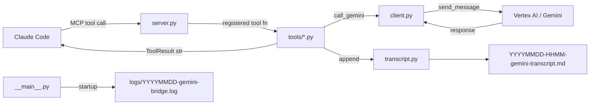

<h1 align="center">gemini-bridge</h1>
<h4 align="center">Gemini as a live sounding board for Claude Code — Vertex AI, persistent sessions, structured logging.</h4>

<p align="center">
  
  
  
  
  
</p>

gemini-bridge is an MCP server that gives Claude Code a live Gemini counterpart. When Claude is working on a hard problem — an architectural decision, a tricky bug, a code review — it can consult Gemini as a second opinion without switching tools or context.

Sessions persist across all tool calls within a Claude Code session. Gemini accumulates context naturally across tools and turns. Every exchange is appended to a dated Markdown transcript file. The server logs to a daily rotating file so you can watch it live.

Five focused tools, each with a distinct system prompt persona. Not a 37-tool Swiss Army knife.

**Quick navigation:** [What it does](#what-it-does) | [Prerequisites](#prerequisites) | [Quick start](#quick-start) | [Configuration](#configuration) | [Auth methods](#auth-methods) | [Logging](#logging) | [Tools](#tools) | [Architecture](#architecture) | [Project structure](#project-structure) | [Full documentation](#full-documentation)

---

## What it does

| Tool | Persona | Required parameters |
|---|---|---|
| `gemini_ask` | Direct, precise — general purpose | `prompt` |
| `gemini_brainstorm` | Devil's advocate, unconventional | `topic` |
| `gemini_review` | Critical, severity-first | `content` |
| `gemini_debug` | Evidence-based, hypothesis-driven | `error` |
| `gemini_architect` | Opinionated, explicit tradeoffs | `description` |

All tools share optional `thinking` (`none`/`low`/`medium`/`high`) and `session_name` parameters. Claude picks thinking level based on question complexity.

**Session model:** One Gemini chat session per tool name per Claude Code process. Context accumulates naturally within a session — later calls can reference earlier ones.

**Transcript logging:** Every exchange appended to `{transcript_dir}/YYYYMMDD-HHMM-gemini-transcript.md`.

**Server logging:** Structured logs at `~/.config/gemini-bridge/logs/YYYYMMDD-gemini-bridge.log`.

---

## Prerequisites

| Requirement | Notes |
|---|---|
| Python 3.11+ | `python3 --version` |
| gcloud CLI | [Install guide](https://cloud.google.com/sdk/docs/install) |
| GCP project | With Vertex AI (Agent Platform) API enabled |
| Claude Code | MCP-enabled version |
| Auth | ADC, SA key file, or Apple Keychain — see [Auth methods](#auth-methods) |

---

## Quick start

```bash
# 1. Clone and install
git clone https://github.com/PCS-LAB-ORG/gemini-bridge.git
cd gemini-bridge
pip install -e .

# 2. Configure (interactive wizard — reads existing config as defaults on re-run)
bash setup.sh

# 3. Register with Claude Code
claude mcp add -s user gemini-bridge -- python3 -m gemini_bridge

# 4. Verify
claude mcp list
```

Restart Claude Code after step 3. On next start you'll see startup entries in the log:

```
[gemini-bridge] 17:50:10 INFO  gemini_bridge.__main__: starting — auth=keychain model=gemini-3.1-pro-preview location=global
[gemini-bridge] 17:50:10 INFO  gemini_bridge.__main__: transcript → ~/session-summaries/20260702-1750-gemini-transcript.md
```

---

## Configuration

**Config file:** `~/.config/gemini-bridge/config.json` — created by `setup.sh`, safe to edit by hand.

| Field | Default | Description |
|---|---|---|
| `project` | — | GCP project ID (required) |
| `location` | `global` | Vertex AI location; `global` works for all models; specific regions for gemini-2.x only |
| `model` | `gemini-2.5-flash` | Gemini model ID (`gemini-2.*` or `gemini-3.*`) |
| `default_thinking` | `medium` | Thinking level when omitted per call |
| `transcript_dir` | `~/session-summaries` | Directory for exchange transcripts |
| `auth.method` | `adc` | `adc` · `env` · `keychain` |
| `auth.keychain_service` | `gemini-bridge` | Keychain service name (keychain method only) |
| `auth.keychain_account` | `vertex-sa` | Keychain account name (keychain method only) |

See [docs/configuration.md](docs/configuration.md) for full field reference including location constraints per model family.

---

## Auth methods

Three methods supported — `setup.sh` walks you through all of them.

**ADC (recommended for personal machines):**
```bash
gcloud auth application-default login
# Sets method: "adc" in config
```
One-time setup. SDK auto-refreshes. Note: `gcloud auth login` (CLI) and ADC are separate credential stores — see [docs/auth.md](docs/auth.md).

**Env file (service account key on disk):**
```bash
export GOOGLE_APPLICATION_CREDENTIALS=/path/to/sa-key.json
# Sets method: "env" in config
```
Set the env var before starting Claude Code. Key file stays on disk — use only on full-disk-encrypted machines.

**Apple Keychain (recommended for DLP-sensitive environments, macOS only):**
```bash
security add-generic-password \
  -s "gemini-bridge" -a "vertex-sa" \
  -w "$(cat /path/to/sa-key.json)"
rm /path/to/sa-key.json   # remove disk copy
# Sets method: "keychain" in config
```
SA JSON loaded to memory at startup; zero disk artifact after store. `setup.sh` verifies the item exists and contains valid JSON before writing config.

**Minimum GCP role for service account:** `roles/aiplatform.user` (renamed from "Vertex AI Platform User" to "Agent Platform User" in 2026 — same role ID `roles/aiplatform.user`).

---

## Logging

The server writes structured logs to a daily rotating file — four days retained, current day always active.

**Log file location:**
```
~/.config/gemini-bridge/logs/YYYYMMDD-gemini-bridge.log
```

**Tail live:**
```bash
tail -f ~/.config/gemini-bridge/logs/$(ls -t ~/.config/gemini-bridge/logs/*.log | head -1 | xargs basename)
```

**Log levels** (set via `GEMINI_BRIDGE_LOG_LEVEL` env var, default `INFO`):

| Level | What you see |
|---|---|
| `INFO` | Startup (auth method, model, transcript path) |
| `WARNING` | Transcript write failures, empty Gemini responses |
| `ERROR` | Auth failures, inference failures — with context |
| `DEBUG` | Per-call tool name, session, thinking level, response length |

Set `GEMINI_BRIDGE_LOG_LEVEL=DEBUG` before starting Claude Code for full call-level detail.

---

## Tools

See [docs/tools.md](docs/tools.md) for system prompts, parameter docs, and example prompts for each tool.

**Thinking levels** — Claude picks per call based on complexity:

| Level | Gemini 2.x (`thinking_budget`) | Gemini 3.x (`thinking_level`) |
|---|---|---|
| `none` | 0 tokens | MINIMAL |
| `low` | 1024 tokens | LOW |
| `medium` | 8192 tokens | MEDIUM |
| `high` | 32768 tokens | HIGH |

---

## Architecture



**Startup sequence:** `__main__.py` configures logging → loads config → builds credentials → instantiates `GeminiClient` + `TranscriptWriter` → `build_server()` registers all 5 tools → `server.run()`.

Sessions are keyed by `tool_name:session_name`. Each tool maintains its own chat history so system prompt personas stay locked for the session.

---

## Project structure

```
gemini-bridge/
├── pyproject.toml
├── setup.sh                    # interactive configuration wizard (re-run safe)
├── session-summaries/          # Markdown transcripts, one file per Claude Code session
├── docs/
│   ├── README.md               # documentation index
│   ├── architecture.md         # component diagram, session lifecycle, SOLID mapping
│   ├── auth.md                 # all auth methods, troubleshooting, ADC vs gcloud auth
│   ├── configuration.md        # full config.json field reference
│   ├── development.md          # dev setup, tests, logging, adding a new tool
│   ├── logging.md              # log file location, levels, tail command, rotation
│   ├── roadmap.md              # v1–v5 with rationale and shipped status
│   ├── tools.md                # system prompts, parameters, examples
│   └── transcripts.md          # transcript format, session boundaries
└── src/
    └── gemini_bridge/
        ├── __main__.py         # entry: python -m gemini_bridge (configures logging)
        ├── server.py           # MCP server construction, tool registration
        ├── client.py           # Gemini session manager, ask() interface
        ├── config.py           # config.json loading and validation
        ├── auth.py             # credential loading (ADC, env, Keychain)
        ├── transcript.py       # session transcript writing
        └── tools/
            ├── base.py         # ToolResult type, call_gemini() helper
            ├── ask.py
            ├── brainstorm.py
            ├── review.py
            ├── debug.py
            └── architect.py
```

---

## Roadmap

| Version | Status | Features |
|---|---|---|
| v1.0 | ✓ Shipped | 5 tools, ADC auth, single persistent session, transcript logging, full docs |
| v1.1 | ✓ Shipped | Env-file SA auth fallback (`GOOGLE_APPLICATION_CREDENTIALS`) |
| v2.5 | ✓ Shipped | Apple Keychain auth (macOS) — SA JSON in Keychain, zero disk artifact |
| v2.0 | Roadmap | Named sessions (`gemini_new_session`, `session_name` routing) |
| v3.0 | Roadmap | `gemini_set_transcript_dir` — per-project transcript routing without config edit |

See [docs/roadmap.md](docs/roadmap.md) for detailed rationale per phase.

---

## Full documentation

See [docs/README.md](docs/README.md) for the complete documentation index.
