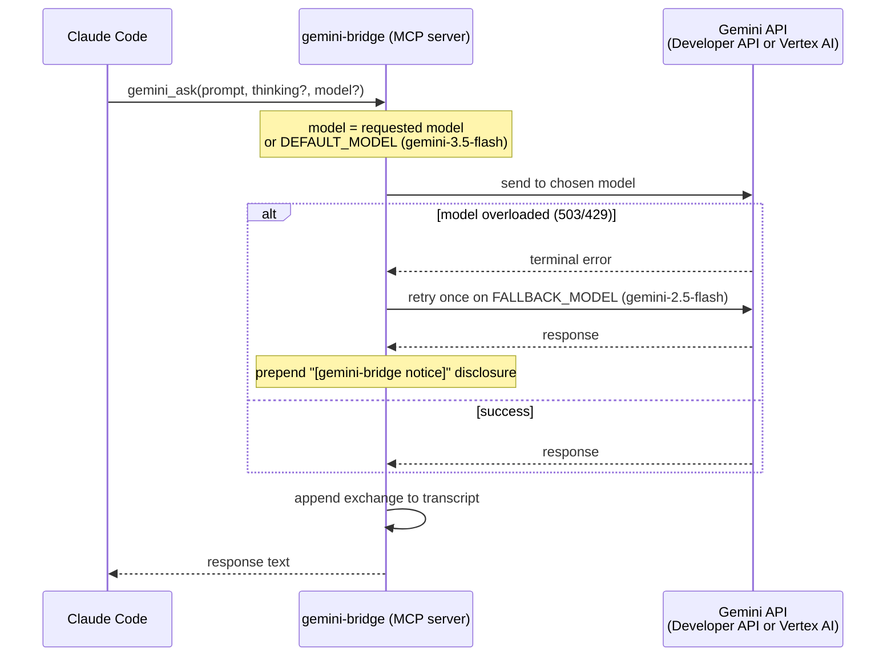

<h1 align="center">gemini-bridge</h1>
<h4 align="center">Gemini as a live sounding board for Claude Code — Vertex AI, persistent sessions, structured logging.</h4>

<p align="center">
  
  
  
  
  
</p>

gemini-bridge is an MCP server that gives Claude Code a live Gemini counterpart. When Claude is working on a hard problem — an architectural decision, a tricky bug, a code review — it can consult Gemini as a second opinion without switching tools or context.

Sessions persist across all tool calls within a Claude Code session. Gemini accumulates context naturally across tools and turns. Every exchange is appended to a dated Markdown transcript file. The server logs to a daily rotating file so you can watch it live.

Five focused tools, each with a distinct system prompt persona. Not a 37-tool Swiss Army knife.

**Quick navigation:** [What it does](#what-it-does) | [How it works](#how-it-works) | [Prerequisites](#prerequisites) | [Quick start](#quick-start) | [Configuration](#configuration) | [Choosing a model](#choosing-a-model) | [Auth methods](#auth-methods) | [Thinking levels](#thinking-levels) | [Roadmap](#roadmap) | [Full documentation](#full-documentation)

---

## What it does

| Tool | Persona | Required parameters |
|---|---|---|
| `gemini_ask` | Direct, precise — general purpose | `prompt` |
| `gemini_brainstorm` | Devil's advocate, unconventional | `topic` |
| `gemini_review` | Critical, severity-first | `content` |
| `gemini_debug` | Evidence-based, hypothesis-driven | `error` |
| `gemini_architect` | Opinionated, explicit tradeoffs | `description` |

All five inference tools share optional `thinking` (`none`/`low`/`medium`/`high`), `session_name`, and `model` parameters. Claude picks thinking level based on question complexity, and may pick a `model` per call (omit for the server default).

A sixth utility tool, **`gemini_list_models`**, returns the chat-capable models available on your active backend — use it to discover valid `model=` values. See [Choosing a model](#choosing-a-model).

**Session model:** One Gemini chat session per tool name per Claude Code process. Context accumulates naturally within a session — later calls can reference earlier ones. Changing `model` starts a separate session (sessions are keyed by tool + name + model).

**Transcript logging:** Every exchange appended to `{transcript_dir}/YYYYMMDD-HHMM-gemini-bridge-transcript.md`.

**Server logging:** Structured logs at `~/.config/gemini-bridge/logs/YYYYMMDD-gemini-bridge.log`. See [docs/logging.md](docs/logging.md).

---

## How it works



---

## Prerequisites

| Requirement | Notes |
|---|---|
| Python 3.11+ | `python3 --version` |
| Claude Code | MCP-enabled version |
| Auth | **API key (easiest):** `export GEMINI_API_KEY=...` — get one at [aistudio.google.com/apikey](https://aistudio.google.com/apikey), no GCP needed · **Vertex AI:** ADC, SA key file, or Apple Keychain — requires gcloud CLI + GCP project — see [Auth methods](#auth-methods) |

---

## Quick start

```bash
# 1. Clone and install
git clone https://github.com/PCS-LAB-ORG/gemini-bridge.git
cd gemini-bridge
python3 -m pip install -e .

# 2. Configure (interactive wizard — reads existing config as defaults on re-run)
bash setup.sh

# 3. Register with Claude Code
claude mcp add -s user gemini-bridge -- python3 -m gemini_bridge

# 4. Verify
claude mcp list
```

Restart Claude Code after step 3. On next start you'll see startup entries in the log:

```
[gemini-bridge] 17:50:10 INFO  gemini_bridge.__main__: starting — auth=keychain location=global default_thinking=medium default_model=gemini-3.5-flash
[gemini-bridge] 17:50:10 INFO  gemini_bridge.__main__: transcript → ~/session-summaries/20260702-1750-gemini-bridge-transcript.md
```

---

## Configuration

**Config file:** `~/.config/gemini-bridge/config.json` — created by `setup.sh`, safe to edit by hand.

| Field | Default | Description |
|---|---|---|
| `project` | — | GCP project ID (required for `adc`/`env`/`keychain`; omit for `api_key`) |
| `location` | `global` | Vertex AI location; `global` is recommended and works for all models; omit for `api_key` |
| `default_thinking` | `medium` | Thinking level when omitted per call |
| `transcript_dir` | `./session-summaries` | Transcript directory; relative paths resolve to the project root where Claude Code was launched |
| `auth.method` | `adc` | `adc` · `env` · `keychain` · `api_key` |
| `auth.keychain_service` | `gemini-bridge` | Keychain service name (`keychain` only) |
| `auth.keychain_account` | `vertex-sa` | Keychain account name (`keychain` only) |
| `auth.api_key_env` | `GEMINI_API_KEY` | Env var name holding the AI Studio key (`api_key` only; key is never stored in config) |

> **Note:** There is no `model` config field. The default model is built into the server
> (`gemini-3.5-flash`); select a different model **per call** via the `model=` parameter on any
> tool. See [Choosing a model](#choosing-a-model).

See [docs/configuration.md](docs/configuration.md) for the full field reference.

---

## Choosing a model

Every tool accepts an optional `model=` parameter. Omit it to use the server default
(`gemini-3.5-flash`), which transparently falls back to `gemini-2.5-flash` if the endpoint is
overloaded (503/429), with a visible notice in the response.

The recommended set is **backend-aware** — the `model` parameter's description adapts to your
active backend, and `gemini_list_models` returns the live, chat-only catalog:

| Backend (`auth.method`) | Recommended models | `-latest` aliases |
|---|---|---|
| **Developer API** (`api_key`) | `gemini-3.5-flash` (default), `gemini-2.5-flash`, `gemini-flash-latest`, `gemini-pro-latest`, `gemini-2.5-pro` | ✅ supported |
| **Vertex AI** (`adc`/`env`/`keychain`) | `gemini-3.5-flash` (default), `gemini-2.5-flash`, `gemini-2.5-pro`, `gemini-3.1-flash-lite` | ❌ 404 on Vertex — use versioned names |

`-latest` aliases (e.g. `gemini-flash-latest`) are a **Developer-API-only** convention; they
return 404 on Vertex AI. Call `gemini_list_models` any time for the authoritative list scoped to
your backend. See [docs/configuration.md](docs/configuration.md#choosing-a-model) and
[docs/tools.md](docs/tools.md#gemini_list_models).

---

## Auth methods

Four methods supported — `setup.sh` walks you through all of them.

**ADC (recommended for personal machines):**
```bash
gcloud auth application-default login
# Sets method: "adc" in config
```
One-time setup. SDK auto-refreshes. Note: `gcloud auth login` (CLI) and ADC are separate credential stores — see [docs/auth.md](docs/auth.md).

**Env file (service account key on disk):**
```bash
export GOOGLE_APPLICATION_CREDENTIALS=/path/to/sa-key.json
# Sets method: "env" in config
```
Set the env var before starting Claude Code. Key file stays on disk — use only on full-disk-encrypted machines.

**Apple Keychain (recommended for DLP-sensitive environments, macOS only):**
```bash
security add-generic-password \
  -s "gemini-bridge" -a "vertex-sa" \
  -w "$(cat /path/to/sa-key.json)"
rm /path/to/sa-key.json   # remove disk copy
# Sets method: "keychain" in config
```
SA JSON loaded to memory at startup; zero disk artifact after store. `setup.sh` verifies the item exists and contains valid JSON before writing config.

**API key (Google AI Studio — no GCP project needed):**
```bash
export GEMINI_API_KEY=AIza...
# Sets method: "api_key" in config
```
Get a key at [aistudio.google.com/apikey](https://aistudio.google.com/apikey). No GCP project, no `gcloud` setup. Lower quota limits than Vertex AI — suitable for personal use and quick setup. The key is read from the env var at startup; it is never written to `config.json`.

**Minimum GCP role for service account:** `roles/aiplatform.user` (renamed from "Vertex AI Platform User" to "Agent Platform User" in 2026 — same role ID `roles/aiplatform.user`). Not required for `api_key` mode.

---

## Thinking levels

Claude picks per call based on question complexity. See [docs/tools.md](docs/tools.md) for full tool documentation.

| Level | Gemini 2.x (`thinking_budget`) | Gemini 3.x (`thinking_level`) |
|---|---|---|
| `none` | 0 tokens | MINIMAL |
| `low` | 1024 tokens | LOW |
| `medium` | 8192 tokens | MEDIUM |
| `high` | 32768 tokens | HIGH |

---

## Roadmap

| Release | Status | Highlights |
|---|---|---|
| 26.7.1 | ✓ Shipped | 5 tools · ADC, env + Keychain auth · persistent sessions · transcript logging · structured logging · full docs |
| 26.7.2 | Planned | Named sessions · per-project transcript routing · Google AI Studio API key auth |

See [docs/roadmap.md](docs/roadmap.md) for full phase breakdown and rationale.

---

## Full documentation

See [docs/README.md](docs/README.md) for the complete documentation index.
