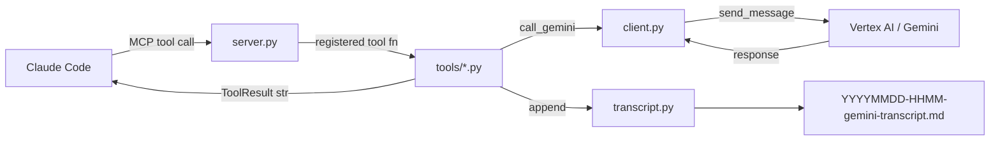

<h1 align="center">gemini-bridge</h1>
<h4 align="center">Gemini as a live sounding board for Claude Code — via Vertex AI, ADC auth, persistent sessions.</h4>

<p align="center">
  
  
  
  
</p>

gemini-bridge is an MCP server that gives Claude Code a live Gemini counterpart. When Claude
is working on a hard problem — an architectural decision, a tricky bug, a code review — it can
consult Gemini as a second opinion without switching tools or context.

Sessions persist across all tool calls within a Claude Code session. Gemini accumulates context
naturally. Every exchange is appended to a Markdown transcript file for the session.

Five focused tools, each with a distinct system prompt persona. Not a 37-tool Swiss Army knife.

**Quick navigation:** [What it does](#what-it-does) | [Prerequisites](#prerequisites) | [Quick start](#quick-start) | [Project structure](#project-structure) | [Architecture](#architecture) | [Configuration](#configuration) | [Auth methods](#auth-methods) | [Tools](#tools) | [Full documentation](#full-documentation)

---

## What it does

| Tool | Persona | Parameters |
|---|---|---|
| `gemini_ask` | Direct, precise — general purpose | `prompt` |
| `gemini_brainstorm` | Devil's advocate, unconventional | `topic`, `context?` |
| `gemini_review` | Critical, severity-first | `content`, `question?` |
| `gemini_debug` | Evidence-based, hypothesis-driven | `error`, `context?` |
| `gemini_architect` | Opinionated, explicit tradeoffs | `description`, `question?` |

All tools share optional `thinking` (`none`/`low`/`medium`/`high`) and `session_name` parameters.

**Session model:** One default Gemini chat object per server process. All calls within a Claude
Code session share the same history.

**Transcript logging:** Every exchange is appended to
`{transcript_dir}/YYYYMMDD-HHMM-gemini-transcript.md`.

---

## Prerequisites

| Requirement | Notes |
|---|---|
| Python 3.11+ | `python3 --version` |
| gcloud CLI | [Install guide](https://cloud.google.com/sdk/docs/install) |
| ADC configured | `gcloud auth application-default login` (once) |
| Vertex AI enabled | Enable in your GCP project |
| Claude Code | MCP-enabled version |

---

## Quick start

```bash
# 1. Clone and install
git clone https://github.com/PCS-LAB-ORG/gemini-bridge.git
cd gemini-bridge
pip install -e .

# 2. Configure (interactive wizard)
bash setup.sh

# 3. Register with Claude Code
claude mcp add -s user gemini-bridge -- python3 -m gemini_bridge

# 4. Verify
claude mcp list
```

Restart Claude Code after step 3.

---

## Project structure

```
gemini-bridge/
├── pyproject.toml
├── setup.sh                    # interactive configuration wizard
├── session-summaries/          # default transcript location during development
├── docs/
│   ├── README.md               # documentation index
│   ├── architecture.md
│   ├── auth.md
│   ├── configuration.md
│   ├── tools.md
│   ├── transcripts.md
│   ├── development.md
│   └── roadmap.md
└── src/
    └── gemini_bridge/
        ├── __main__.py         # entry: python -m gemini_bridge
        ├── server.py           # MCP server, tool registration
        ├── client.py           # Gemini session manager, ask()
        ├── config.py           # config.json loading and validation
        ├── auth.py             # credential loading (ADC, env, Keychain)
        ├── transcript.py       # session transcript writing
        └── tools/
            ├── base.py         # ToolResult type, call_gemini() helper
            ├── ask.py
            ├── brainstorm.py
            ├── review.py
            ├── debug.py
            └── architect.py
```

---

## Architecture



**Startup:** `__main__.py` loads config → builds credentials → instantiates `GeminiClient` +
`TranscriptWriter` → `build_server()` registers all 5 tools → `server.run()`.

---

## Configuration

**Config file:** `~/.config/gemini-bridge/config.json` (created by `setup.sh`)

| Field | Default | Description |
|---|---|---|
| `project` | — | GCP project ID (required) |
| `location` | `global` | Vertex AI location; `global` works for all models; specific regions only for gemini-2.x |
| `model` | `gemini-2.5-flash` | Gemini model ID |
| `default_thinking` | `medium` | Thinking level when omitted per call |
| `transcript_dir` | `~/session-summaries` | Transcript directory |
| `auth.method` | `adc` | `adc`, `env`, or `keychain` (v2.5) |

See [docs/configuration.md](docs/configuration.md) for full reference.

---

## Auth methods

**ADC (default):** `gcloud auth application-default login` once. SDK auto-refreshes.
`gcloud auth login` and ADC are separate credential stores — see [docs/auth.md](docs/auth.md).

**Env file (fallback):** `GOOGLE_APPLICATION_CREDENTIALS=/path/to/sa-key.json`.

**Keychain (v2.5 roadmap):** SA JSON in Apple Keychain, loaded to memory at startup. macOS only.

---

## Tools

See [docs/tools.md](docs/tools.md) for system prompts, parameter docs, and examples.

**Thinking levels** — Claude picks per call based on complexity:

| Level | Gemini 2.x (`thinking_budget`) | Gemini 3.x (`thinking_level`) |
|---|---|---|
| `none` | 0 tokens | MINIMAL |
| `low` | 1024 tokens | LOW |
| `medium` | 8192 tokens | MEDIUM |
| `high` | 32768 tokens | HIGH |

---

## Known limitations / roadmap

See [docs/roadmap.md](docs/roadmap.md) for the full v1–v5 roadmap with rationale.

v1 → single session, ADC auth, 5 tools, transcript logging
v1.1 → env-file SA auth
v2 → named sessions
v2.5 → Keychain auth (macOS)
v3 → per-project transcript routing

---

## Full documentation

See [docs/README.md](docs/README.md) for the complete documentation index.
