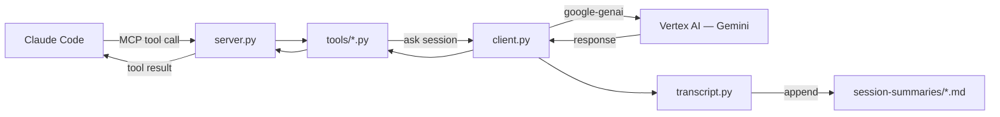

<h1 align="center">gemini-bridge</h1>
<h4 align="center">Gemini as a live sounding board for Claude Code — Vertex AI, ADC auth, persistent sessions.</h4>

<div align="center">


</div>

An MCP server that gives Claude Code a live Gemini counterpart during development sessions.
Five specialized tools — brainstorm, review, debug, architect, and ask — share a persistent
Gemini chat session for the lifetime of the Claude Code process. Every exchange is appended
to a session transcript so nothing is lost.

Authentication uses Google Cloud Application Default Credentials via Vertex AI — no API
keys, no credential files on disk.

> **Status:** Under active development. See [plan.md](plan.md) for full specification and
> [docs/roadmap.md](docs/roadmap.md) for the phased delivery plan.

---

### Quick navigation

[What it does](#what-it-does) | [Prerequisites](#prerequisites) | [Quick start](#quick-start) | [Project structure](#project-structure)
[Architecture](#architecture) | [Configuration](#configuration) | [Auth methods](#auth-methods) | [Full Documentation](docs/README.md)

---

## What it does

Five MCP tools that Claude Code can invoke against a shared Gemini session:

| Tool | Purpose |
|---|---|
| `gemini_brainstorm` | Divergent ideation — Gemini challenges Claude's direction, offers alternatives |
| `gemini_review` | Critical code or design review — finds problems, prioritizes by severity |
| `gemini_debug` | Root cause hypotheses from evidence — systematic, not speculative |
| `gemini_architect` | System design tradeoffs — opinionated where warranted |
| `gemini_ask` | General purpose — when no specialized tool fits |

All tools share a single persistent Gemini chat session. Gemini accumulates context
naturally across multiple tool calls within one Claude Code session. Every exchange is
appended to `session-summaries/YYYYMMDD-HHMM-gemini-transcript.md`.

Optional `thinking` parameter (`none` | `low` | `medium` | `high`) — Claude judges
appropriate depth per call. Server translates to the correct API parameter for whichever
Gemini model is configured.

---

## Prerequisites

| Requirement | Version | Notes |
|---|---|---|
| Python | 3.11+ | `python3 --version` |
| gcloud CLI | any recent | `gcloud --version` |
| ADC credentials | — | `gcloud auth application-default login` |
| Claude Code | MCP-capable | `claude --version` |

---

## Quick start

### 1. Clone and install

```bash
git clone https://github.com/PCS-LAB-ORG/gemini-bridge.git
cd gemini-bridge
python3 -m venv .venv && source .venv/bin/activate
pip install -e .
```

### 2. Configure

```bash
bash setup.sh
```

The wizard checks your ADC credentials, prompts for GCP project and Gemini model,
and writes `~/.config/gemini-bridge/config.json`.

### 3. Register with Claude Code

```bash
claude mcp add -s user gemini-bridge python -m gemini_bridge
```

Verify: `claude mcp list` — `gemini-bridge` should appear.

---

## Project structure

```
src/gemini_bridge/
  __main__.py         # entry point: python -m gemini_bridge
  server.py           # MCP server, tool registration
  client.py           # GeminiClient, persistent session state
  config.py           # load/validate ~/.config/gemini-bridge/config.json
  auth.py             # ADC, Keychain SA, env-file credential loading
  transcript.py       # session transcript append
  tools/
    base.py           # ToolResult type, shared parameter definitions
    ask.py
    brainstorm.py
    review.py
    debug.py
    architect.py

docs/                 # full documentation (see docs/README.md)
setup.sh              # interactive configure wizard
tests/                # one test file per source module
```

---

## Architecture



Auth is Application Default Credentials throughout. No API keys. No credential files
on disk (Keychain option available in v2.5 for service account auth).

---

## Configuration

Config file: `~/.config/gemini-bridge/config.json`

| Field | Type | Default | Description |
|---|---|---|---|
| `project` | string | — | GCP project ID for Vertex AI billing |
| `location` | string | `us-central1` | Vertex AI region |
| `model` | string | `gemini-2.5-flash` | Gemini model ID |
| `default_thinking` | string | `medium` | Thinking level when tool call omits `thinking` param |
| `transcript_dir` | string | `~/session-summaries` | Where to write transcript files |
| `auth.method` | string | `adc` | Auth method: `adc`, `env`, or `keychain` (v2.5) |

Run `bash setup.sh` to create or update this file interactively.

---

## Auth methods

**ADC (default)** — `gcloud auth application-default login` once. The SDK auto-refreshes
access tokens using the stored refresh token. No re-auth required during normal use.
Works with any Vertex AI-enabled GCP project.

**Env file** — Set `GOOGLE_APPLICATION_CREDENTIALS=/path/to/sa-key.json` before starting
Claude Code. Least preferred — leaves a credential file on disk.

**Apple Keychain (v2.5 roadmap)** — Service account JSON stored in macOS Keychain, loaded
into process memory at startup, never written to disk. The recommended approach for
service account auth. See [docs/auth.md](docs/auth.md).

---

## Full Documentation

[docs/README.md](docs/README.md) — complete documentation index including architecture,
auth setup, tool reference, transcript format, development guide, and roadmap.
