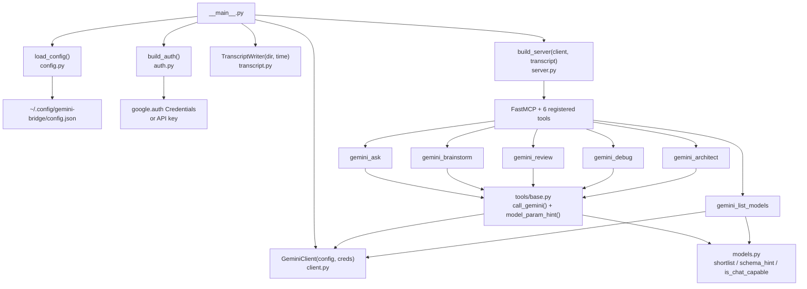
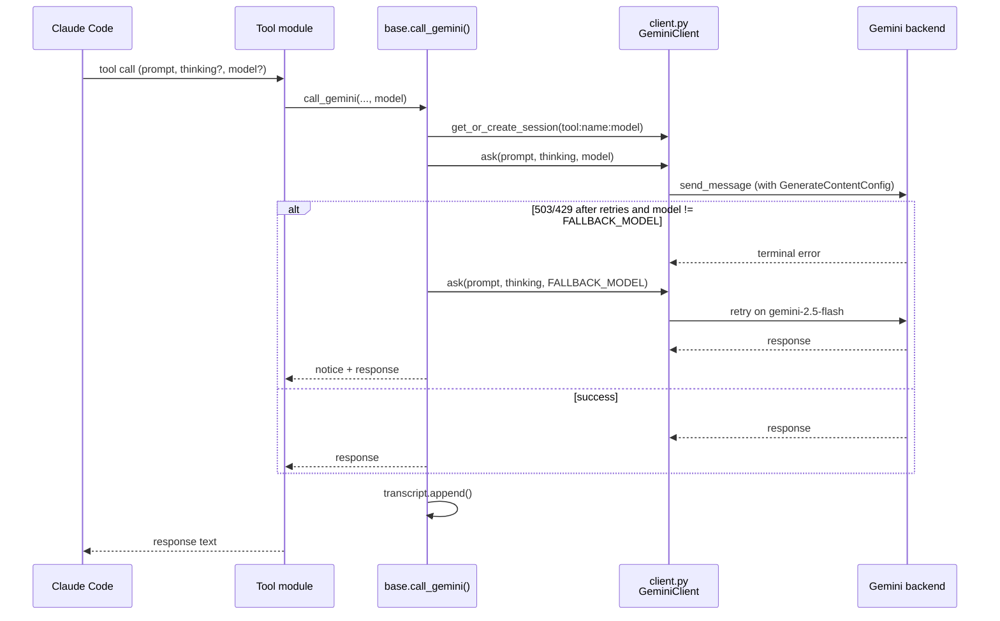

# Architecture

## Component Diagram

The inference tools route through `tools/base.py`; `gemini_list_models` calls the client
directly. Both consult `models.py` — the single source of truth for the model taxonomy
(backend shortlists, the backend-aware schema hint, and the chat-capable filter).

## Data Flow (per inference tool call)

1. Claude Code sends an MCP tool call (e.g. `gemini_brainstorm`) with an optional `model=`
2. `server.py` routes to the registered tool function in `tools/brainstorm.py`
3. Tool calls `call_gemini()` from `tools/base.py` with the session name, system prompt, and prompt
4. `call_gemini()` resolves the effective model (`model` or `DEFAULT_MODEL`) and calls
   `client.get_or_create_session()` — one session per `tool:session_name:model`
5. `client.ask()` builds a `GenerateContentConfig` with the thinking level and sends to the
   active backend (Developer API or Vertex AI)
6. On a terminal 503/429, `call_gemini()` retries once against `FALLBACK_MODEL` and prepends a
   disclosure notice to the response
7. `transcript.append()` writes the exchange to the Markdown file
8. Tool returns the response string as the MCP tool result to Claude Code

## Session Lifecycle

- **Created:** on first call to any tool, keyed by `tool_name:session_name`
- **Persists:** for the lifetime of the MCP server process (one Claude Code session)
- **Accumulates context:** Gemini's `Chat` object retains message history automatically
- **Destroyed:** when Claude Code restarts (new server process, new sessions)

Each tool uses its own session key (`gemini_ask:default`, `gemini_brainstorm:default`, etc.)
so the system prompt persona is locked for the session.

## Transcript Lifecycle

- **File created:** at server startup, named with the startup timestamp
- **File path:** `{transcript_dir}/YYYYMMDD-HHMM-gemini-bridge-transcript.md`
- **Appended:** after every successful Gemini response
- **Never truncated:** append-only; write errors go to stderr, never break tool calls
- **Per session:** one file per Claude Code process lifetime

## SOLID Notes

| Principle | How it's enforced |
|---|---|
| SRP | Each module owns exactly one concern |
| OCP | New tools: add file + one line in server.py. New auth: add loader + one branch |
| LSP | All auth paths return `Credentials`; all tools return `ToolResult` |
| ISP | Tools receive only `GeminiClient` — not server or config objects |
| DIP | `client.py` depends on `Credentials` abstraction; `server.py` depends on callables |
