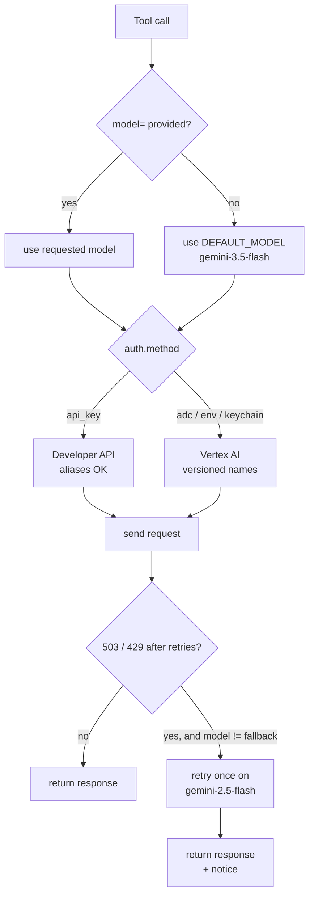

# Configuration Reference

**Config file location:** `~/.config/gemini-bridge/config.json`

Created by `bash setup.sh`. Safe to edit by hand.

## Full example

```json
{
  "project": "my-gcp-project",
  "location": "global",
  "default_thinking": "medium",
  "transcript_dir": "./session-summaries",
  "auth": {
    "method": "adc"
  }
}
```

> **There is no `model` config field.** The default model is built into the server and the model
> is chosen **per call** via the `model=` parameter. See [Choosing a model](#choosing-a-model).

## Field reference

### `project`

**Type:** string
**Example:** `"my-gcp-project"`
**Required when:** `auth.method` is `adc`, `env`, or `keychain`
**Omit when:** `auth.method = "api_key"` (Developer API does not use a GCP project)

Your GCP project ID. Must have the Vertex AI API enabled and `roles/aiplatform.user`
granted to your ADC credentials or service account.

---

### `location`

**Type:** string
**Default:** `"global"`
**Example:** `"us-central1"`

Vertex AI location. `"global"` works for all models and is the recommended default. Only used
by the Vertex AI backends (`adc`/`env`/`keychain`); ignored in `api_key` mode.

`"global"` routes to the lowest-latency region automatically and is the safest choice —
newer models (e.g. `gemini-3.5-flash`) are frequently **global-only**. Set a specific region
(e.g. `us-central1`, `europe-west1`) only if you have a data-residency requirement, and confirm
your chosen model is offered there; a model not served in your region returns a 404 at call time.

> **Note:** The server does not currently validate location against the chosen model at startup —
> `"global"` is recommended precisely because it sidesteps per-model regional gaps.
> (Backend/location-aware validation is tracked as a future enhancement.)

---

### Model selection

There is **no `model` config field.** Model choice is per-call — see
[Choosing a model](#choosing-a-model) below.

---

### `default_thinking`

**Type:** string
**Default:** `"medium"`
**Valid values:** `none`, `low`, `medium`, `high`

Used when a tool call omits the `thinking` parameter. Claude overrides this per call when
it judges a different level is appropriate.

---

### `transcript_dir`

**Type:** string (path, `~` and `.` expanded relative to Claude Code's working directory)
**Default:** `"./session-summaries"`

Directory where transcript files are written. Created if it doesn't exist. Transcript files
are named `YYYYMMDD-HHMM-gemini-bridge-transcript.md` using the server startup time.

The default `./session-summaries` resolves relative to the project root where Claude Code
was launched — transcripts land in `your-project/session-summaries/` automatically, one
directory per project. Override with an absolute path (e.g. `"~/gemini-transcripts"`) to
collect transcripts globally instead.

---

### `auth.method`

**Type:** string
**Default:** `"adc"`
**Valid values:** `adc`, `env`, `keychain`, `api_key`

See [auth.md](auth.md) for full setup instructions for each method.

---

### `auth.keychain_service`

**Type:** string
**Default:** `"gemini-bridge"`
**Only used when:** `auth.method = "keychain"`

The service name used in `security find-generic-password -s {service}`.

---

### `auth.keychain_account`

**Type:** string
**Default:** `"vertex-sa"`
**Only used when:** `auth.method = "keychain"`

The account name used in `security find-generic-password -a {account}`.

---

### `auth.api_key_env`

**Type:** string
**Default:** `"GEMINI_API_KEY"`
**Only used when:** `auth.method = "api_key"`

The name of the environment variable holding your Google AI Studio API key. The key itself
is never stored in `config.json` — only the variable name. At server startup, the server
reads the key from this env var and raises an error if it is unset or empty.

Common values: `"GEMINI_API_KEY"` (AI Studio default), `"GOOGLE_API_KEY"` (alternative).
If both are set in your shell, `GOOGLE_API_KEY` takes precedence in the SDK.

---

## Choosing a model

Model selection is **per call**, not per config. Every tool accepts an optional `model=`
parameter; omit it to use the server default.

- **Default:** `gemini-3.5-flash` (built into the server as `DEFAULT_MODEL`).
- **Fallback:** if the requested/default model returns a terminal overload (503/429) after
  retries, the call is retried once against `gemini-2.5-flash` (`FALLBACK_MODEL`) and the
  response is prefixed with a visible `[gemini-bridge notice]` so the substitution is never silent.
- **Discovery:** the `model` parameter's description is **backend-aware** (it lists the models
  valid for your active backend), and the `gemini_list_models` tool returns the live, chat-only
  catalog. See [tools.md](tools.md#gemini_list_models).

### Recommended models by backend

| Backend (`auth.method`) | Recommended | Notes |
|---|---|---|
| **Developer API** (`api_key`) | `gemini-3.5-flash` (default), `gemini-2.5-flash`, `gemini-flash-latest`, `gemini-pro-latest`, `gemini-2.5-pro` | `-latest` aliases auto-track the newest release |
| **Vertex AI** (`adc`/`env`/`keychain`) | `gemini-3.5-flash` (default), `gemini-2.5-flash`, `gemini-2.5-pro`, `gemini-3.1-flash-lite` | No `-latest` aliases — they 404 on Vertex; use versioned names |

The `-latest` aliases (e.g. `gemini-flash-latest`) are a **Developer-API-only** convention.
On Vertex AI they return 404 — the bridge logs a warning if you pass one under a Vertex backend.

> **Model families and thinking levels:** the generation prefix determines how the `thinking`
> level maps to API parameters — `gemini-2*` (and `-latest` aliases) use a token `thinking_budget`;
> `gemini-3*` uses a `thinking_level` enum. Both dotted (`gemini-3.5-flash`) and hyphenated
> preview (`gemini-3-pro-preview`) forms are recognized, so previews are usable. An unrecognized
> name raises a `ClientError` at call time. See [tools.md](tools.md) for the thinking-level table.

### How a model value is resolved


