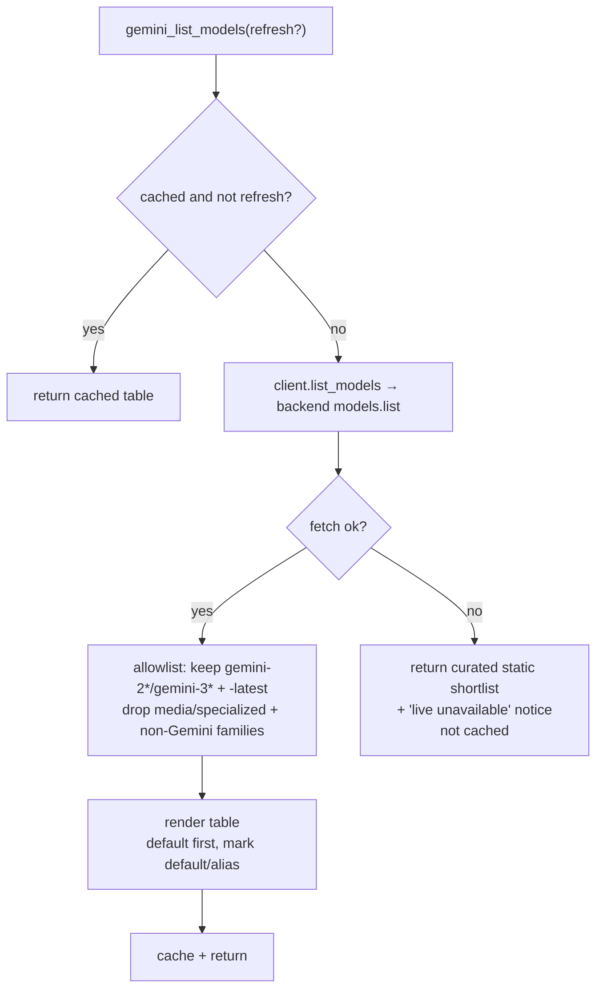

# Tools Reference

Six tools: five inference tools (`gemini_ask`, `gemini_brainstorm`, `gemini_review`,
`gemini_debug`, `gemini_architect`) and one discovery utility (`gemini_list_models`).

The five inference tools share three optional parameters:
- `thinking: "none" | "low" | "medium" | "high"` — reasoning depth; falls back to `default_thinking` in config
- `session_name: str` — session identifier; v1 always uses the default session per tool
- `model: str` — Gemini model id; omit for the server default (`gemini-3.5-flash`). The
  parameter's description is **backend-aware** (it lists the models valid for your active
  backend). Sessions are keyed by tool + `session_name` + `model`, so switching model starts a
  fresh session. Call [`gemini_list_models`](#gemini_list_models) to discover valid values, and
  see [configuration.md](configuration.md#choosing-a-model) for the recommended set and fallback
  behavior.

---

## gemini_ask

**Persona:** Direct, precise technical assistant. No specialized persona — use when no other tool fits.

**System prompt:**
> You are a knowledgeable technical assistant working alongside Claude, another AI. Answer
> directly and precisely. Prefer concrete examples. When uncertain, say so.

**Parameters:**
| Parameter | Type | Required | Description |
|---|---|---|---|
| `prompt` | string | yes | The question or request |
| `thinking` | string | no | Reasoning depth |
| `session_name` | string | no | Session identifier (default: `"default"`) |
| `model` | string | no | Gemini model id; omit for the server default (`gemini-3.5-flash`) |

**When to use:**
- Direct questions with clear answers
- API lookups, syntax questions
- Anything that doesn't fit the specialized tools

**Example:**
```
gemini_ask(prompt="What's the difference between asyncio.gather and asyncio.wait?")
```

---

## gemini_brainstorm

**Persona:** Creative thinking partner. Challenges Claude's direction, pushes unconventional approaches, plays devil's advocate.

**System prompt:**
> You are a creative thinking partner working alongside Claude, another AI. Push unconventional
> approaches. Challenge Claude's existing direction. Play devil's advocate when useful. Offer
> alternatives even when the current path seems fine. Be concise.

**Parameters:**
| Parameter | Type | Required | Description |
|---|---|---|---|
| `topic` | string | yes | The topic or problem to brainstorm about |
| `context` | string | no | What Claude is currently doing or has considered |
| `thinking` | string | no | Reasoning depth |
| `session_name` | string | no | Session identifier |
| `model` | string | no | Gemini model id; omit for the server default (`gemini-3.5-flash`) |

**When to use:**
- Design decisions where you want a second take
- Stuck on an approach and need alternatives
- Validating a plan by stress-testing it

**Example:**
```
gemini_brainstorm(
    topic="How should we structure retry logic for the Pub/Sub consumer?",
    context="Currently planning exponential backoff with a dead-letter queue"
)
```

---

## gemini_review

**Persona:** Critical technical reviewer. Finds problems, prioritizes by severity, doesn't soften feedback.

**System prompt:**
> You are a critical technical reviewer working alongside Claude, another AI. Find problems,
> risks, and weaknesses in code, designs, and plans. Be direct. Don't soften feedback.
> Prioritize by severity. If something is sound, say so briefly and move on.

**Parameters:**
| Parameter | Type | Required | Description |
|---|---|---|---|
| `content` | string | yes | Code, design, or plan to review |
| `question` | string | no | Specific question to focus the review |
| `thinking` | string | no | Reasoning depth |
| `session_name` | string | no | Session identifier |
| `model` | string | no | Gemini model id; omit for the server default (`gemini-3.5-flash`) |

**When to use:**
- Code review before merging
- Design review for a proposed architecture
- Checking a plan for risks before executing

**Example:**
```
gemini_review(
    content=f"```python\n{code}\n```",
    question="Is there a race condition in the session cleanup logic?"
)
```

---

## gemini_debug

**Persona:** Systematic debugging assistant. Generates evidence-based root cause hypotheses and specific diagnostic steps.

**System prompt:**
> You are a systematic debugging assistant working alongside Claude, another AI. Generate
> root cause hypotheses from the evidence provided. Reason through failure modes. Suggest
> specific diagnostic steps. Don't guess without basis — reason from what's shown.

**Parameters:**
| Parameter | Type | Required | Description |
|---|---|---|---|
| `error` | string | yes | Error message, stack trace, or failure description |
| `context` | string | no | Relevant code, recent changes, environment details |
| `thinking` | string | no | Reasoning depth (use `high` for complex failures) |
| `session_name` | string | no | Session identifier |
| `model` | string | no | Gemini model id; omit for the server default (`gemini-3.5-flash`) |

**When to use:**
- Unexplained test failures
- Production errors with unclear root cause
- Intermittent bugs that are hard to reproduce

**Example:**
```
gemini_debug(
    error="ConnectionResetError: [Errno 54] Connection reset by peer",
    context="Happens only on the 3rd request to the Pub/Sub emulator, after a 30s idle period"
)
```

---

## gemini_architect

**Persona:** Software architecture advisor. Opinionated when a clearly better path exists, names tradeoffs explicitly when context-dependent.

**System prompt:**
> You are a software architecture advisor working alongside Claude, another AI. Evaluate
> system designs, suggest patterns, identify scalability and maintainability concerns.
> Be opinionated when a clearly better path exists. Name tradeoffs explicitly when the
> choice is genuinely context-dependent.

**Parameters:**
| Parameter | Type | Required | Description |
|---|---|---|---|
| `description` | string | yes | System design or architecture to evaluate |
| `question` | string | no | Specific architecture question or concern |
| `thinking` | string | no | Reasoning depth (use `high` for complex systems) |
| `session_name` | string | no | Session identifier |
| `model` | string | no | Gemini model id; omit for the server default (`gemini-3.5-flash`) |

**When to use:**
- Choosing between architectural patterns
- Evaluating a design for scalability or maintainability concerns
- Getting an opinion on a technical direction before committing

**Example:**
```
gemini_architect(
    description="We're building a multi-tenant SaaS on GCP. Each tenant gets their own Pub/Sub topic...",
    question="Is per-tenant topic isolation worth the operational overhead at 1000 tenants?"
)
```

---

## gemini_list_models

**Purpose:** Discovery utility — lists the Gemini models available on the bridge's active
backend, so Claude (or you) can pick a valid value for the `model=` parameter. This is a
metadata call, not an inference: it has no `thinking` or `session_name` parameter and is not
written to the transcript.

**Parameters:**
| Parameter | Type | Required | Description |
|---|---|---|---|
| `refresh` | bool | no | Re-fetch the live list, bypassing the per-process cache (default `false`) |

**Behavior:**
- Fetches the live catalog via the backend's `models.list`, then keeps only models the bridge
  can actually run — an **allowlist**: recognized Gemini chat generations (`gemini-2*` /
  `gemini-3*`, dotted or hyphenated) plus `-latest` aliases. Everything else is dropped:
  - media/specialized variants by name marker — `image`, `tts`, `audio`, `embedding`, `live`,
    `computer-use`, `robotics`, `omni` (several of these report `generateContent` too, so a
    name check is required — the action alone is not sufficient);
  - non-Gemini families the bridge can't run — Gemma, Lyria, Nano-Banana, Antigravity,
    Deep Research, etc.
  - **Previews are kept** (e.g. `gemini-3-pro-preview`) — they are valid, usable models.
- Renders a compact table: model id, display name, and `(default)` / `(alias)` markers, headed
  by the active backend name. The default is listed first.
- Caches the result for the process lifetime; `refresh=true` forces a re-fetch.
- **Graceful degradation:** if the live catalog can't be fetched, returns the curated static
  shortlist (from `models.py`) with a clear "live list unavailable" notice instead of failing.

> **Note:** the list is a *discovery aid*, not a hard whitelist — an explicitly-requested valid
> model still runs even if it isn't listed (e.g. a specialized `gemini-2*`/`gemini-3*` variant).

**Example:**
```
gemini_list_models()
gemini_list_models(refresh=True)   # force a fresh fetch
```

**Sample output** (api_key / Developer API backend; abridged — your live list reflects the
current catalog):
```
Gemini chat models on Developer API (Google AI Studio) (17 available):

  gemini-3.5-flash                    (default)  — Gemini 3.5 Flash
  gemini-2.5-flash                    — Gemini 2.5 Flash
  gemini-2.5-pro                      — Gemini 2.5 Pro
  gemini-3-pro-preview                — Gemini 3 Pro Preview
  gemini-3.1-pro-preview              — Gemini 3.1 Pro Preview
  gemini-flash-latest                 (alias)  — Gemini Flash Latest
  gemini-pro-latest                   (alias)  — Gemini Pro Latest
  …

Pass model='<id>' to any tool. Omit to use the default (gemini-3.5-flash).
```
On a Vertex backend the header names Vertex AI and the `-latest` aliases are absent.

**How it resolves:**



See [configuration.md](configuration.md#choosing-a-model) for the recommended models per backend.
